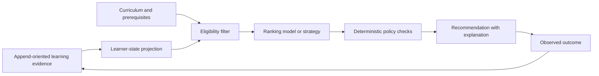

# Adaptive Pathway Architecture

- Status: accepted
- Canonical for: adaptive-learning decision flow and authority

## Flow

## Responsibilities

- Assessment owns evidence of attempts, scores, and review.
- Learner model owns derived mastery and progress state.
- Curriculum owns competencies, prerequisites, and pathway structure.
- Adaptation owns eligibility, ranking orchestration, policy application, and recommendation records.
- AI orchestration may provide a ranking or explanation capability but does not own final eligibility or durable learner state.

## Recommendation Record

A durable recommendation should identify:

- learner and learning-context identifiers,
- eligible candidate set or reproducible candidate query,
- selected activity and alternatives where appropriate,
- policy and model/strategy versions,
- relevant learner-state and curriculum versions,
- reason, confidence, and constraints,
- time and expiration,
- later outcome evidence.

## Safety and Evaluation

- Prerequisites, permissions, accessibility constraints, exclusions, and course requirements are deterministic gates.
- Model output is advisory and validated.
- Experiment assignment, consent, and outcome metrics are explicit.
- Evaluation measures learning outcomes and harm or exclusion indicators, not engagement alone.
- A rule-based baseline remains available for comparison and safe fallback.

