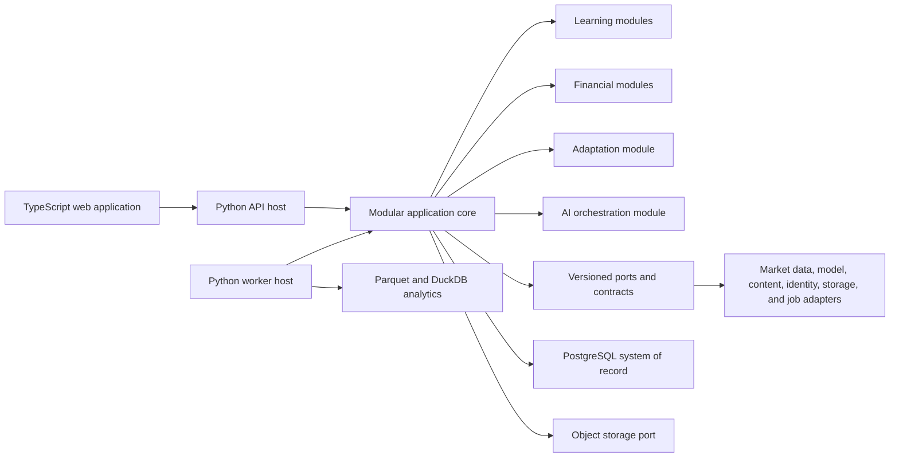

# System Overview

- Status: accepted
- Canonical for: high-level system shape
- Related docs: `modular-monolith.md`, `../deployment/local-cloud-capability-parity.md`

## System Shape

## Primary Processes

- **Web application:** TypeScript browser experience for learners, instructors, administrators, and local users.
- **API host:** FastAPI composition exposing authenticated application operations and generated OpenAPI.
- **Worker host:** asynchronous ingestion, backtesting, document processing, model evaluation, embeddings, and recommendation projection work.
- **CLI host:** local setup, diagnostics, backup, restore, contract inspection, and administrative operations.

The API, worker, and CLI are entry points into the same Python application package. They do not contain domain policy.

## Storage Responsibilities

- PostgreSQL owns transactional state, identifiers, job metadata, learner records, course state, portfolios, and audit references.
- Parquet holds larger immutable or versioned analytical datasets.
- DuckDB queries local or object-backed analytical data without becoming the transactional source of truth.
- Object storage holds content, imports, exports, generated artifacts, and dataset objects behind stable storage keys.

## Deployment Profiles

- The local profile uses containerized PostgreSQL, local filesystem object storage, local DuckDB/Parquet, and local or external model/data adapters.
- The cloud profile uses managed equivalents, tenant-aware identity and authorization, horizontally scalable hosts, and managed operational controls.
- Both profiles expose the same domain semantics and public contract versions.

## Explicit Non-Goals

- Microservices as the initial repository structure
- Provider-specific domain models
- LLM-controlled grading, financial calculation, authorization, or portfolio mutation
- Separate community and cloud domain implementations
- A notebook serving as production application logic

