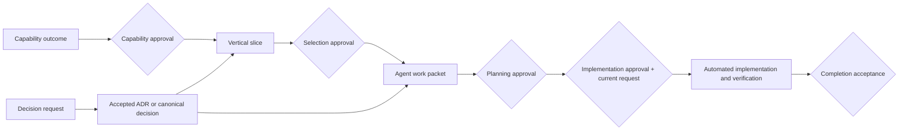

# Automated Development Planning

- Status: accepted
- Canonical for: planning artifact structure, readiness states, and promotion into delivery sequencing

## Purpose

This directory shapes future work so an automated development agent can execute a bounded task without inventing product meaning, architecture, contracts, policy, or acceptance criteria during implementation.

Planning artifacts are working coordination records. They do not override product, domain, architecture, contract, risk, security, standard, or ADR authority. A `ready` planning state means an artifact is sufficiently specified for scheduling; it does not grant implementation authority by itself.

The proposed [Product Capability Catalog](../product/capability-catalog.md) is the current outcome-oriented inventory from which capability shaping may draw. Catalog entries are planning inputs only; each must be bounded, checked against current decisions, recorded as its own `CAP-*` artifact, and explicitly approved before slice selection.

## Work Hierarchy

| Level | Stored in | Purpose |
| --- | --- | --- |
| Capability | `capabilities/` | Describe a coherent user or operator outcome and its boundaries |
| Vertical slice | `vertical-slices/` | Define the smallest end-to-end increment that produces observable value |
| Agent work packet | `work-packets/` | Give one agent one independently verifiable implementation objective |
| Decision request | `decision-requests/` | Isolate a choice that must be resolved before dependent work proceeds |

Use [the planning register](register.md) as the inventory. Use the files under [templates](templates/README.md) to create new artifacts; do not put feature plans in a README.

Use the [governed planning skill suite](skills/README.md) for deterministic shaping, decision review, vertical selection, packet authoring, approvals, implementation, verification, and “what next?” routing. Skills assist the workflow but remain subordinate to this guide and all higher repository authority.

Use the [concurrent-work protocol](concurrent-work.md) for ID reservation, write-scope declarations, generated artifacts, packet claims, and ownership transfer. Run `python dev-tools/planning/check_planning.py` after changing an artifact or register row.

## Lifecycle

Every artifact uses exactly one `planning_status` value:

| State | Meaning |
| --- | --- |
| `captured` | The need is recorded but not sufficiently shaped |
| `shaping` | Scope, dependencies, contracts, and evidence are being defined |
| `decision-blocked` | A named unresolved decision prevents safe planning or execution |
| `ready` | The artifact is bounded, decision-ready, testable, and eligible to schedule |
| `active` | Authorized implementation or decision work is underway |
| `verifying` | The change exists and required evidence is being gathered |
| `complete` | Acceptance evidence and documentation impact are recorded |
| `superseded` | The artifact is replaced or intentionally abandoned, with a reason and replacement when applicable |

State changes update both the artifact and `register.md` in the same change. Moving from `ready` to `active` requires an approved local implementation decision and a current explicit user instruction to implement the named work.

## Approval Stages

An absent local record means a stage is pending. Recorded decisions use `approved`, `changes-requested`, or `rejected`. An agent may prepare a review and record an explicit authorized human decision; it may not self-approve.

| Stage | Subject and local ledger stage | Required before |
| --- | --- | --- |
| Capability framing | `CAP-*` / `capability` | Candidate slices are selected |
| Durable decision | `DEC-*` / `decision`, followed by canonical promotion | Dependent planning or implementation is unblocked |
| Slice selection | `SLI-*` / `selection` | Work packets are authored |
| Plan readiness | `WRK-*` / `planning` | Implementation activation is considered |
| Implementation activation | `WRK-*` / `implementation`, with local authority and reviewed scope | A current explicit implementation request may start work |
| Completion acceptance | `SLI-*` / `completion` | The slice moves from verifying to complete |

Earlier approval, planning readiness, an accepted roadmap, or a general advice request never supplies a later approval automatically. External, destructive, credentialed, production, publication, commit, and push actions retain their own authority requirements.

Approval stages remain independent, while eligible members at one stage may share one human decision point. Use one consolidated response for an explicitly enumerated related `DEC-*` set, one selected slice's closed `WRK-*` planning set, or the same frozen `WRK-*` implementation set. Record one local entry per artifact. A later or materially revised decision, packet, or `write_scope` is outside the bundle and requires renewed approval. After slice-wide implementation approval, claim, implement, verify, and complete packets serially in dependency order without another approval prompt between unchanged preauthorized packets.

### Local-only approval storage

Every approval and reviewer record lives only in `.local-codex/approvals/ledger.json`, which is ignored. Use `python dev-tools/planning/manage_approval.py` or the portable `approve-planned-work` scripts to record or inspect it. The local record contains the decision or review status, a local actor/reviewer label, date, authority reference, optional reviewed scope, and note.

Tracked artifacts and the planning register retain only public planning state, canonical decision links, scope, claims, and non-sensitive planning history. They must never contain approval metadata, approval histories, approval summaries, approver/reviewer labels or identifiers, approval dates, authority references, or reviewed scope copied from the local ledger. Public CI validates structure; guarded local actions validate the ledger. Losing the ignored ledger requires the human decisions to be re-established locally—it must not be reconstructed by inferring approval from public state.

## Planning Flow

Plan cross-boundary work in this dependency order:

1. Decision and risk posture
2. Domain meaning and invariants
3. Public contract or event
4. Application behavior
5. Adapter and persistence behavior
6. Host, API, job, or client composition
7. Interface behavior
8. End-to-end and operational qualification

Later layers may be planned in parallel only when their inputs are accepted contracts and their file ownership does not overlap.

## Readiness Rules

A vertical slice or work packet is `ready` only when it:

- names one observable outcome and a parent capability;
- links the minimum canonical context instead of copying it;
- identifies all applicable decision gates from `docs/adr/decision-readiness.md`;
- has the required local approval stage for its lifecycle state;
- names affected boundaries, contracts, consumers, data, and documentation;
- has explicit in-scope and out-of-scope work;
- declares dependencies and whether parallel execution is safe;
- defines scenario-based acceptance, including relevant denial and failure paths;
- lists executable focused and repository-level verification;
- defines stop conditions for ambiguity, conflict, missing authority, or unsafe expansion;
- is small enough for one agent to implement and verify without a new product or architecture decision.

Acceptance scenarios should cover the relevant subset of success, malformed input, unauthorized access, replay or duplicate delivery, stale versions, provider timeout or degradation, local/cloud parity, provenance, accessibility, and light/dark presentation. Do not add irrelevant scenarios merely to fill a template.

## Automated Execution Rules

- Use `guide-next-planning-action` for broad next-step requests; it is read-only by default.
- Route context through `docs/context/prompt-routing.md` and read current canonical sources at execution time.
- Treat the packet as bounded coordination input, not as higher authority than the repository or current user instruction.
- Stop when a packet depends on a `proposed` or `decision-required` boundary, or when its assumptions conflict with current canonical sources.
- Do not start implementation until slice selection, packet planning, and implementation activation approvals are recorded locally and the user currently asks to implement the named slice or work. A slice-wide instruction covers only its exact frozen packet bundle and scopes.
- Give one agent ownership of an active packet. Run multiple packets concurrently only when dependencies and write scopes are explicitly independent.
- Reserve new IDs before authoring, declare repository-relative write scopes before planning approval, and claim locally approved packets before moving them to `active`.
- Treat `.agents/skills/` as an ignored discovery installation; `docs/planning/skills/` remains canonical.
- Keep implementation, tests, contract updates, canonical documentation, derived context, and completion evidence in the same change when they describe one behavior change.
- Record exact verification results and residual gaps before marking work `complete`.

## Relationship to Roadmaps

Planning artifacts answer what an outcome is, how it can be sliced, and what an agent must prove. [Implementation roadmaps](../roadmaps/README.md) record accepted sequencing for bounded approved work. A roadmap should link its source capability, slices, and packets; the planning records should link back once promoted.

No feature work is planned in this directory yet. The scaffold defines the method only.

Before handoff, run the aggregate `python dev-tools/agent/check_ready.py` gate plus every focused or boundary-specific check named by the packet.
