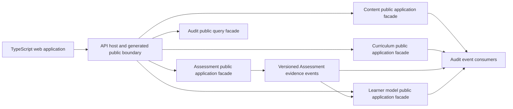

# Decision Request: Assign Ownership for the First Learning Loop

## Decision Needed

Choose the module ownership and public coordination boundaries for versioned lesson content, curriculum placement, deterministic assessment evidence, completion projection, and audit/provenance in CAP-0001.

## Why Now

CAP-0001 could not safely select or plan an implementation slice while its learning-loop ownership remained proposed. Candidate A needs clear Content and Curriculum ownership; Candidate B adds Assessment evidence; Candidate C adds a completion projection. Deferring the choice would have allowed the first implementation to establish accidental ownership through file placement, table access, or private imports.

## Current Authority and Constraints

- [CAP-0001](../capabilities/CAP-0001-complete-structured-introductory-lesson.md) requires a versioned lesson, deterministic assessment evidence, and a completion projection without mastery claims.
- The [module map](../../architecture/modules/module-map.md) now records the first-loop Content, Curriculum, Assessment, Learner model, and Audit responsibilities accepted by ADR-0005.
- [Architecture principles](../../architecture/system/architecture-principles.md) require modules to own behavior and data within a modular monolith.
- [Module dependency rules](../../architecture/modules/module-dependency-rules.md) prohibit access to another module's internals and require public facades or versioned events.
- The [adaptive pathway architecture](../../architecture/learning/adaptive-pathway-architecture.md) assigns attempts and scores to Assessment and derived progress to the Learner model.
- Learning evidence is append-oriented; a completion projection must not replace its source evidence.

## Decision Classification

| Decision | Readiness | Viable options | Recommendation | Blocking DEC |
| --- | --- | --- | --- | --- |
| First learning-loop module ownership | ready | A. Accept the bounded Content, Curriculum, Assessment, Learner model, and Audit modules | Use the Option A boundaries accepted by ADR-0005 | none |
| Cross-module coordination | constrained | Published typed application facades for synchronous work and registered versioned events for asynchronous work | Use the accepted public-facade and versioned-event path | none |
| Attempt and score authority | constrained | Assessment owns attempts and scores, with deterministic application/domain policy as the only grading authority | Use the accepted Assessment-owned deterministic path | none |
| Completion-view authority | constrained | Learner model derives progress and completion projections from append-oriented learning evidence | Use the accepted evidence-to-projection path | none |
| Audit participation | constrained | Audit retains cross-cutting references, provenance, and administrative evidence without becoming the source of Content, Curriculum, Assessment, or Learner-model facts | Use reference-only audit participation | none |
| Initial deployment shape | ready | One Python module-first modular monolith, shared by local and managed-cloud profiles, with multiple composition hosts as needed | Use the accepted shared-core modular-monolith path | none |

Canonical authority for the nonblocking rows:

- Cross-module coordination and retained foreign identifiers are governed by the [modular-monolith architecture](../../architecture/system/modular-monolith.md) and [module dependency rules](../../architecture/modules/module-dependency-rules.md).
- Assessment evidence and Learner-model projection authority are governed by the [adaptive pathway architecture](../../architecture/learning/adaptive-pathway-architecture.md), while deterministic grading is required by the [architecture principles](../../architecture/system/architecture-principles.md).
- Module-owned data and reference-only audit participation follow the one-owner rule in the [architecture principles](../../architecture/system/architecture-principles.md); the proposed [module map](../../architecture/modules/module-map.md) supplies the initial Audit boundary to be accepted through this decision.
- The deployment shape is accepted by [ADR-0001](../../adr/ADR-0001-python-typescript-modular-monolith.md) and the shared local/cloud core by [ADR-0004](../../adr/ADR-0004-shared-core-local-cloud.md).

## Options

| Option | Benefits | Costs and risks | Contracts and operations affected | Reversibility |
| --- | --- | --- | --- | --- |
| A. Accept the proposed bounded modules | Content owns versioned lesson resources and provenance; Curriculum owns placement and prerequisites; Assessment owns items, attempts, deterministic scores, and completion evidence; Learner model owns derived completion/progress views; Audit retains cross-cutting references. Preserves the clearest semantic ownership and future adaptive-learning inputs. | Introduces several public seams in the first slice and requires disciplined composition even though all modules remain in one process. | Content-version queries/events, curriculum activity references, assessment commands and evidence events, learner-state projection inputs, audit references, persistence ownership. | High. Boundaries are in-repository packages and contracts; implementations can be reorganized without changing semantics when contracts are preserved. |
| B. Combine Content and Curriculum initially | Reduces one boundary for lesson retrieval while keeping Assessment and Learner model distinct. | Blurs reusable content from curriculum placement and may complicate later reuse, localization, or multiple curricula. | Combined learning-resource facade and storage; assessment and learner-state seams remain separate. | Medium. A later split requires data ownership and contract migration. |
| C. Use one broad Learning module initially | Minimizes early cross-module calls and setup. | Makes content, grading evidence, and derived learner state easy to conflate; increases circular dependencies and weakens automated architecture checks. | One broad facade and persistence boundary, with future extraction across most learning contracts. | Low to medium. Later separation would cross data, events, and public APIs established by early slices. |

## Recommendation

**Recommend Option A: accept the proposed bounded modules for the first learning loop.**

- **Verified:** accepted architecture requires modular ownership, public seams, deterministic grading, append-oriented evidence, and separation of Assessment evidence from Learner model projections.
- **Assumption to validate:** the proposed names communicate the domain clearly enough for the first slice and do not create circular application dependencies.
- **Inference:** preserving these boundaries now is less costly than extracting them after persistence and API contracts exist, while remaining far lighter than deploying separate services.

## Canonical Direction

[ADR-0005](../../adr/ADR-0005-first-learning-loop-module-ownership.md) records **Option A: accept the proposed bounded modules** as the canonical direction.

## Evidence Package

### Responsibility Walkthrough

These are semantic responsibilities and provisional public operations, not executable schemas, HTTP paths, storage layouts, or implementation authority.

| CAP-0001 responsibility | Kind | Owner | Public boundary and source-of-truth rule |
| --- | --- | --- | --- |
| Resolve a learning activity in its curriculum context | Query | Curriculum | A typed query returns immutable content and assessment version references. Curriculum owns placement and prerequisites, without reading other modules' tables. |
| Retrieve the approved lesson, objectives, sources, body, and provenance | Query | Content | A typed query accepts the exact content version. Content owns the versioned resource and cannot silently substitute a newer version. |
| Retrieve the bounded knowledge check and scoring rule | Query | Assessment | A typed query accepts the exact assessment version. Assessment owns item meaning, answer constraints, deterministic scoring inputs, and review state. |
| Submit a learner response | Command | Assessment | A typed command receives learner context, immutable activity/content/assessment references, response, and idempotency input. Assessment alone writes attempt and response evidence. |
| Score and retain bounded completion evidence | Command/workflow | Assessment | Assessment validates versions, applies deterministic policy, and appends score and completion evidence. AI cannot grade or mutate it. |
| Review attempt, response, score, and completion evidence | Query | Assessment | A typed query returns the authorized learner's Assessment-owned evidence history. |
| Derive and display minimal activity completion | Projection/query | Learner model | An idempotent consumer projects versioned Assessment evidence; a typed query returns projection and source references. The projection never replaces evidence or claims mastery. |
| Preserve provenance and decision-trace references | Evidence/query | Audit | Audit consumes registered events and exposes an authorized trace query. It owns audit records, not duplicate business records. |
| Compose the learner-facing response | Host composition | API host | The host calls public facades and later generated API models. It owns no learning, scoring, completion, or audit policy. |

Identity establishes actor and learner context without owning learning semantics; its exact contract remains blocked by [DEC-0002](DEC-0002-local-learner-identity.md). Package representation remains blocked by [DEC-0003](DEC-0003-versioned-lesson-package-format.md).

### Dependency Sketch

Dependency consequences:

- The initial loop needs no synchronous module-to-module call. The API host composes public operations while business rules remain in their modules.
- Curriculum retains immutable Content and Assessment identifiers but never imports their internals or reads their persistence.
- Learner model consumes registered Assessment events; Assessment does not depend on Learner model.
- Audit consumes owner-published events and never calls back to change business state, preventing a cycle.
- Package ingestion, publication, and cross-module registration are outside CAP-0001 and remain subject to DEC-0003 and later slice planning.

### Minimal Contract Inventory

These planning names define semantic seams only. Internal operations use typed Python request/result models. Events require versioned JSON Schemas, examples, compatibility policy, and conformance tests before implementation. Exact fields and wire shapes are not established here.

| Provisional contract | Class | Owner | Consumers | Minimum semantics |
| --- | --- | --- | --- | --- |
| `ResolveLearningActivity` | Application query | Curriculum | API host | Activity identity; immutable content and assessment version references; placement/prerequisite result |
| `GetLearningResourceVersion` | Application query | Content | API host | Exact content version; objectives; body/object references; sources; provenance; publication state |
| `GetKnowledgeCheckVersion` | Application query | Assessment | API host | Exact assessment version; response constraints; deterministic scoring-policy reference; feedback metadata |
| `SubmitKnowledgeCheckAttempt` | Application command | Assessment | API host | Learner context; activity/content/assessment versions; response; idempotency input; validation outcome |
| `GetAssessmentEvidenceHistory` | Application query | Assessment | API host | Authorized learner context; ordered attempts, responses, scores, completion evidence, versions, and provenance |
| `AssessmentAttemptRecorded.v1` | Versioned event | Assessment | Learner model; Audit | Event, learner, attempt, and activity references; content/assessment versions; time; provenance; idempotency evidence |
| `AssessmentScoreRecorded.v1` | Versioned event | Assessment | Learner model; Audit | Attempt reference; scoring-policy version; deterministic result; time; provenance |
| `KnowledgeCheckCompletionEvidenceRecorded.v1` | Versioned event | Assessment | Learner model; Audit | Attempt and source-score references; deterministic completion result; relevant versions; time |
| `GetActivityCompletionProjection` | Application query | Learner model | API host | Learner and activity references; projection version/state; source-evidence references; update time |
| `LearnerCompletionProjectionChanged.v1` | Versioned event | Learner model | Audit; later approved consumers | Projection and activity references; source evidence; derived state; time |
| `GetLearningDecisionTrace` | Application query | Audit | Authorized API/CLI host | Source event and decision references, actors, contract versions, timestamps, and provenance without redefining business truth |

Identity-bearing seams use a provider-neutral learner-context reference whose exact semantics must come from DEC-0002. Lesson and assessment version references must align with DEC-0003. Public REST operations and generated TypeScript bindings require a later approved implementation slice.

### Data Ownership and Audit Confirmation

| Module | Owns | May retain from another module | Must not do |
| --- | --- | --- | --- |
| Content | Versioned lessons, source provenance, publication state, and content storage references | Source and provider references | Own placement, attempts, or learner progress |
| Curriculum | Activity placement, competencies, prerequisites, and immutable content/assessment version references | Stable identifiers and versions | Load or mutate Content or Assessment persistence |
| Assessment | Items, attempts, responses, deterministic scores, review state, and bounded completion evidence | Stable learner, activity, and content-version references | Decide mastery or write Learner-model projections |
| Learner model | Derived completion/progress projections and source-evidence references | Assessment evidence identifiers and relevant activity versions | Rewrite evidence or turn completion into mastery |
| Audit | Audit/provenance records, source-event references, actor/action metadata, and integrity metadata | Stable identifiers, contract versions, summaries, and payload digests | Become a second store of mutable lesson, placement, attempt, score, or learner-state records |

Audit remains independently queryable evidence about actions and decisions while each business fact has exactly one owner. A future need for Audit to retain a legally durable business payload instead of a reference or integrity representation requires a separate security/data decision.

### Architecture Review Conclusion

- **Verified:** Option A conforms to accepted modular-monolith, dependency, contract, deterministic-policy, append-oriented-evidence, and shared-core constraints.
- **Verified:** every CAP-0001 command, query, evidence record, and projection in this walkthrough has one semantic owner.
- **Verified:** the dependency sketch has no cycle, cross-module table read, or private import.
- **Verified:** Audit preserves cross-cutting evidence without becoming a second business source of truth.
- **Approved:** the module names are accepted shared domain language for the initial loop.
- **Known gap:** backend modules and executable contracts do not exist, so import-boundary, public-surface, event-schema, and conformance checks must accompany the first approved implementation slice.
- **Scope limit:** this evidence does not resolve identity, package format, protection/recovery, tenancy, AI, or cloud operations and authorizes no code, schema, migration, or interface work.

This evidence supported canonical promotion of DEC-0001. The resulting ADR does not select a CAP-0001 slice or authorize implementation.

## Evidence Required

- **Prepared:** responsibility walkthrough mapping CAP-0001 commands, queries, evidence records, and projections to one owner.
- **Prepared:** dependency sketch showing published synchronous facades and asynchronous events without cycles.
- **Prepared:** planning-level contract inventory for lesson retrieval, attempt submission, evidence publication, and completion projection.
- **Prepared:** Audit ownership confirmation that preserves trace evidence without duplicating business authority.
- **Satisfied:** ADR-0005 records Option A's names and boundaries as canonical authority.

## Required Authority

Product and architecture decision authority, informed by the domain responsibility walkthrough and architecture consequences. Approval evidence is retained only in the ignored local ledger.

## Decision Record and Promotion

The selected option and rationale are recorded in [ADR-0005](../../adr/ADR-0005-first-learning-loop-module-ownership.md). The module map and decision-readiness register now reflect the accepted boundary, and the planning-level public seams remain inputs to later contract design.

## Dependent Planning Updates

- DEC-0001 has been removed from CAP-0001's unresolved decision gates.
- Reassess all proposed CAP-0001 slices against the accepted ownership boundaries.
- Architecture context and verification guidance now reference the accepted first-loop boundary.

## Planning History

- 2026-08-04: Decision request captured from CAP-0001's proposed module-ownership gate.
- 2026-08-04: The responsibility walkthrough, dependency sketch, contract inventory, Audit boundary review, and architecture review were prepared.
- 2026-08-04: ADR-0005, the module map, decision readiness, context guidance, CAP-0001, and the planning register were synchronized; DEC-0001 moved to `complete`.
